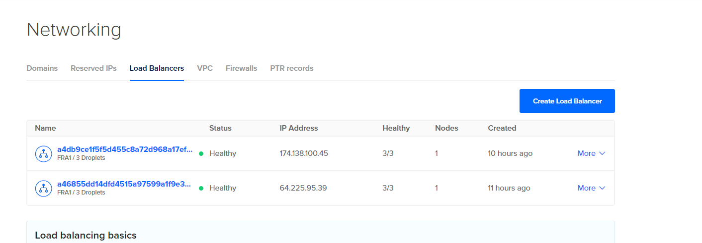

# CI/CD App on DigitalOcean with Github Actions
#### Created by Dmitry Kozhel


## Scheme

This is scheme of CD/CI App on DigitalOcean k8s cluster


For this CI/CD I use:

- Github repository: https://github.com/ferdinant122/projectTMS
- Github Actions
- DigitalOcean
- Slack

## About App 

This simple flask app creates a web server on 80 port and creates simple webpage (index.html) which info about pod name and ip
and I add text which is displayed depending on the cluster prod or dev

```
from flask import Flask,render_template
import socket

app = Flask(__name__)

@app.route("/")
def index():
    try:
        host_name = socket.gethostname()
        host_ip = socket.gethostbyname(host_name)
        return render_template('index.html', hostname=host_name, ip=host_ip, name="DOS-07-DK!! Best APP!")
    except:
        return render_template('error.html')


if __name__ == "__main__":
    app.run(host='0.0.0.0', port=80)
```


## Steps:

Before start CI/CD ``need to create infrastructure``. In this repo https://github.com/ferdinant122/projectTMS-infrastructure I told  how to do it.

### Push code on repo and create account

First developer need to push code on repository 

App consists of several files

| File  | Value |
| ------ | ------ |
| app/app.py  | the application itself on the flask |
| templates/index.html | webpage index.html |
| templates/error.html  | webpage error.html |
| Dockerfile  | Dockerfile from which the application will be built |
| requirements.txt  | file which describes what is needed for the application |
| config/deployment.yml  | file with application deployment to DigitalOcean |


If you create account on DigitalOcean https://cloud.digitalocean.com/ before (when created infrastructure)

In DigitalOcean need to create a acess token it will be used to connect Github Action  to DigitalOcean Cloud


### Create a Github Actions secrets

You need to create a secrets which will be used later


| Secret  | Value |
| ------ | ------ |
| DIGITALOCEAN_ACCESS_TOKEN  | access token to DigitalOcean Cloud |
| REGISTRY_NAME | name of registry on DigitalOcean |
| CLUSTER_NAME_PROD  | id of PROD cluster which was created before |
| CLUSTER_NAME_DEV  | id of DEV cluster which was created before |
| SLACK_WEBHOOK  | webhook to connect slack |


### Create a Github Actions workflows

I create a workflow in ```.github/workflows/workflow.yml``` file

This workflow:
- Checks-out your repository under $GITHUB_WORKSPACE
- Cheks code with pylint
- Install doctl using secrets.DIGITALOCEAN_ACCESS_TOKEN
- Build and push a Docker image of your application in your registry and tag the image with the $GITHUB_SHA
- Deploy to DigitalOcean Kubernetes

Workflow starts on push to main or dev depending on branches.
And also depending on branches deploing app on different clusters(dev,prod)


App in DigitalOcean Registry


after app push on registry start deploing on DigitalOcean

All instructions  are in ``config/deployment.yml``

The file has two parts:

First part

```
apiVersion: apps/v1
kind: Deployment
metadata:
  name: flask-example
  labels:
    app: flask-example
spec:
  replicas: 4
  selector:
    matchLabels:
      app: flask-example
  strategy:
    rollingUpdate:
      maxSurge: 1
      maxUnavailable: 1
  minReadySeconds: 5
  template:
    metadata:
      labels:
        app: flask-example
    spec:
      containers:
      - name: flask-example
        image: <IMAGE>
        ports:
        - containerPort: 80
        resources:
          requests:
            cpu: 100m
          limits:
            cpu: 100m
```

In this part described what app need to use and how numbers of replicas need

Also described is a continuous upgrade strategy that replaces pods when upgraded.

Explane in gif rolling update strategy


And which container need to use (image) with which parameters

Second part

```
apiVersion: v1
kind: Service
metadata:
  name: flask-example-service
spec:
  type: LoadBalancer
  ports:
    - name: http
      protocol: TCP
      port: 80
      targetPort: 80
  selector:
    app: flask-example
```

In this part described creating of load balancer on DigitalOcean to which connected App




### Slack notification

I connect my GitHub Actions on this repo with Slack

Then wen I push code github sends me a message in Slack


### Finish

Now if you open load balancers IP in browser you see this:

PROD


DEV


That's all! You great!


